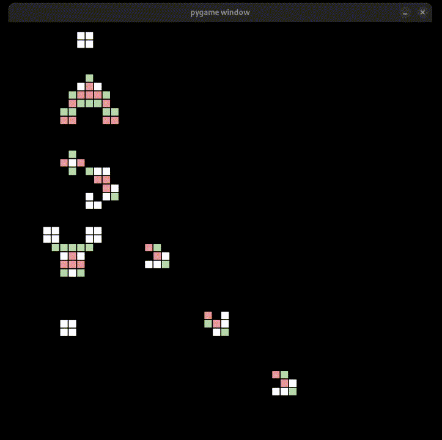

# Conways Game of life

Implemented in python 3.11, using pygame to draw.
able to start from either a random generation or from a preset.

gosper glider (shown below) present adapted from here:
https://github.com/matheusgomes28/pygame-life/blob/main/example_grids.py

this implementation includes a born (in light green) an dying (in light red) state,
which i've found helps visualise the rules in action.

